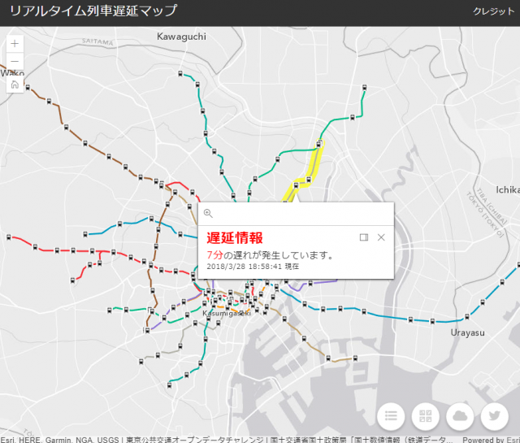

# リアルタイム列車遅延マップ

リアルタイム列車遅延マップは[東京公共交通オープンデータチャレンジ](https://tokyochallenge.odpt.org/)向けに開発した Web アプリです。このリポジトリでは、開発したソース コードおよび設定用の必要なデータを公開しています。

## デモ サイト

※ 2018年5月15日でオープンデータチャレンジは終了しましたので、本アプリの公開も終了いたしました。アクセスいただきましてありがとうございます。

## リポジトリにあるデータの使い方

本リポジトリで公開されているデータを取得し、以下の手順に沿って設定を行うと、ご自分の環境で試してみることができます。

### GIS データの設定

1. `publish/publish_data.zip` をデスクトップ等へ解凍し、解凍された `publish` というフォルダーを `C:\arcgisserver\` の下に配置します。
2. `C:\arcgisserver\publish\` のフォルダーへ移動し、`railroads.mxd` を開きます。[国土数値情報の鉄道データ](http://nlftp.mlit.go.jp/ksj/gml/datalist/KsjTmplt-N02-v2_3.html)を加工した路線および駅のデータが格納されています。
3. `railroads.mxd` を ArcGIS Enterprise へ公開します。
4. `station_label.mxd` を開き、ArcGIS Enterprise へ公開します。`station_label.mxd` は、駅のラベル データです。  
※ データの共有には [ArcGIS Desktop と Network Analyst エクステンション](https://www.esrij.com/products/arcgis-desktop/) および [ArcGIS Enterprise と Network Analyst エクステンション](https://www.esrij.com/products/arcgis-enterprise/) が必要です。

### 東京公共交通オープンデータチャレンジ 配信 API の設定

1. `dbupdate_app/UpdateCurrentTrain/SearchAndUpdateRailway.py` を開き、`set_yourkey` に東京公共交通オープンデータチャレンジから取得したアクセストークンを設定します。  
`SearchAndUpdateRailway.py` は東京公共交通オープンデータチャレンジが配信する API から列車ロケーション情報を取得し、遅延路線を作成するPythonという言語で書かれたスクリプトです。  
※ 東京公共交通オープンデータチャレンジが配信する API の利用には、東京公共交通オープンデータチャレンジへのエントリーが必要です。
2. スクリプトを定期的に実行するため、Windows タスクスケジューラにトリガー：1分間隔、操作：プログラムの開始、プログラム-`Python.exe` までのフルパス、引数の追加で `SearchAndUpdateRailway.py` までのフルパスを設定します。  
※ 指定の時間にスクリプトを実行する方法の詳細は、[Scheduling a Python script or model to run at a prescribed time](https://blogs.esri.com/esri/arcgis/2013/07/30/scheduling-a-scrip/)をご参照ください。

### Web アプリの設定

1. `webapp/app/config/defaults.js` を開き、`layers` に公開したサービスの URL を設定します。
2. `widgets` にウィジェットが使用するサービスの URL を設定します。
  * `WeatherInfo` は[気象オンラインサービス（ベータ版）](https://www.esrij.com/products/data-content-onlinesuite-weather/)が配信する降水ナウキャストを表示するウィジェットです。`itemId` に気象オンラインサービスの降水ナウキャストのアイテム ID を指定します。  
  ※ 気象オンラインサービスの利用には、別途、申込みが必要です。
  * `TwitterInfo` は Twitter から取得した遅延に関するつぶやきを表示するウィジェットです。`webapp/server.js` を開き、`consumerKey`、`consumerSecret`、`accessTokenKey`、`accessTokenSecret` にそれぞれコンシューマー キー、コンシューマー シークレット、アクセス トークン、アクセス トークン シークレットを設定します。  
  ※ Twitter の利用には、[Twitter API](https://developer.twitter.com/) に登録し、API を利用するためのキーを取得する必要があります。
3. `npm install` を実行し、`package.json` の依存モジュールをインストールします。
4. `npm run start` を実行すると、サーバーが立ち上がり Twitter API を利用できるほか、ブラウザーから `http://localhost:3000/` へのアクセスでアプリが表示されます。

## 使用している製品・プロジェクト

* [ArcGIS Desktop と Network Analyst エクステンション](https://www.esrij.com/products/arcgis-desktop/)
* [ArcGIS Enterprise と Network Analyst エクステンション](https://www.esrij.com/products/arcgis-enterprise/)
* [ArcGIS API for JavaScript](http://www.esrij.com/products/arcgis-api-for-javascript/)
* [ArcGIS for Developers](https://developers.arcgis.com/)

## 動作環境

* ArcGIS Desktop と Network Analyst エクステンション
* ArcGIS Enterprise と Network Analyst エクステンション
* Chrome

## 関連リンク

* [リアルタイム列車遅延マップ大解剖 ～東京公共交通オープンデータチャレンジに応募しました！～](https://community.esri.com/docs/DOC-11510)
* [リアルタイム列車遅延マップ大解剖2 ～東京公共交通オープンデータチャレンジに応募しました！～](https://community.esri.com/docs/DOC-11400)

## ライセンス
Copyright 2018 Esri Japan Corporation.

Apache License Version 2.0（「本ライセンス」）に基づいてライセンスされます。あなたがこのファイルを使用するためには、本ライセンスに従わなければなりません。本ライセンスのコピーは下記の場所から入手できます。

> http://www.apache.org/licenses/LICENSE-2.0

適用される法律または書面での同意によって命じられない限り、本ライセンスに基づいて頒布されるソフトウェアは、明示黙示を問わず、いかなる保証も条件もなしに「現状のまま」頒布されます。本ライセンスでの権利と制限を規定した文言については、本ライセンスを参照してください。

ライセンスのコピーは本リポジトリの[ライセンス ファイル](./LICENSE)で利用可能です。

